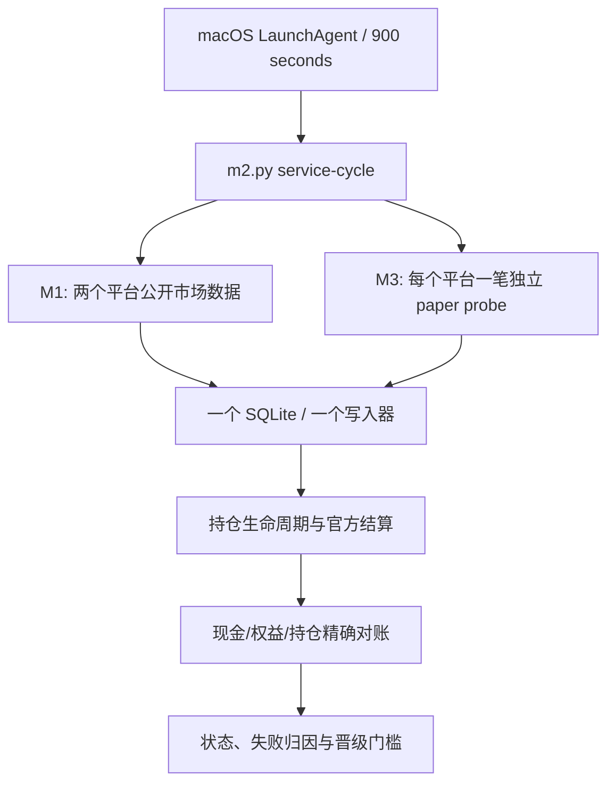

# Polymarket Trading System v1.2.0 — 新对话交接文档

更新时间：2026-08-05（America/New_York）  
适用对象：完全没有聊天上下文、需要继续接管项目的下一位开发者或 Codex 代理。

## 0. 先读这个：真正的仓库在哪里

真正运行、带 Git 历史并连接 GitHub 的源仓库是：

```text
/Users/williamniu/AI/Polymarket-trading-system-v1.2.0
```

远端仓库：

```text
https://github.com/williamniu/polymarket-trading-system-v1.2.0.git
```

当前分支和最后核实的提交：

```text
branch: main
HEAD:   45facf77803b8d2e857a93e05cbee108ef87e5ef
origin/main: 同一提交
```

当前桌面工作区路径：

```text
/Users/williamniu/AI/polymarket-trading-system
```

只是因为 Codex 文件权限而建立的可写暂存副本，**不是 Git 仓库，也不是 LaunchAgent 的工作目录**。不要在这里误判 Git 状态、运行正式服务或继续长期开发。新对话第一条命令应当是：

```bash
cd /Users/williamniu/AI/Polymarket-trading-system-v1.2.0
git status --short
git branch --show-current
git rev-parse HEAD
```

## 1. 我们究竟在做什么

长期目标是打造一套 24/7 运行、可审计、能从每次决策和结果中学习的自动交易系统。它最终应当形成：

```text
可信信息 -> 可证伪假设 -> 现实执行模拟 -> 结果归因
-> 受控改进 -> 新证据 -> 更好的下一轮决策
```

“越用越聪明”不是允许模型自由改代码、改风险线或给自己打分，而是让每一次改进都经过固定测试、样本外验证、shadow deployment、晋级门槛和回滚控制。时间只有在证据链可靠时才产生复利；自动化一个错误的反馈循环，只会让错误复利。

当前阶段只做到 **M3.7 paper execution evidence**。我们已经建立可靠数据、运行基础设施和现实化模拟成交，但还没有建立 M4 的预测信号，因此：

- 没有证明 alpha；
- 没有证明稳定盈利；
- M3 探针盈亏只衡量点差、延迟、深度、费用和生命周期摩擦；
- 不允许把 probe PnL 当成策略收益；
- 没有任何真实钱包、凭证、签名、充值、提现或实盘下单路径；
- M7 实盘仍锁定，未来第一档实盘资金计划为用户重新批准后的 USD 200–300。

第一性原理下，净利润只能来自：

```text
预测优势或结构性优势
- 点差
- 手续费
- 滑点和深度冲击
- 延迟与信息衰减
- 选择偏差和模型错误
- 运营、合规和结算错误
= 可实现净 alpha
```

M0–M3 目前主要是在可靠地测量等号右侧的成本和错误，不是在制造等号左侧的预测优势。市场做市、速度竞争、延迟套利和 maker rebate capture 被明确排除为主要盈利来源。

## 2. 必须先读的文件

接管前按顺序完整阅读：

1. `HANDOFF.md`：当前事实、操作路径和下一步。
2. `FROM_ZERO_DEVELOPMENT_MANUAL.md`：不可绕过的开发、安全和晋级规则。
3. `README.md`：当前架构与日常命令。
4. `docs/USER_DECISIONS.md`：用户可以编辑什么、当前批准值和变更后果。
5. `docs/MENTAL_MODEL.md`：M0–M7 心智模型和三套证据时钟。
6. `docs/ADVERSARIAL_REVIEW.md`：已经攻击过什么、修过什么、还有哪些门槛。
7. `config/risk-policy.json`、`config/m1.json`、`config/m2.json`、`config/m3.json`。
8. 修改代码前再完整阅读相关的 `m1.py`、`m2.py`、`m3.py` 和测试。

不要仅凭本交接文档修改资金、风险或运行逻辑；动态状态必须重新查询，代码事实以仓库为准。

## 3. 当前系统架构

只有一个正式 macOS 定时任务：

```text
LaunchAgent: com.williamniu.polymarket-m2
Python:      /opt/homebrew/bin/python3.11
Command:     m2.py service-cycle
Interval:    900 seconds（15 分钟，预期 96 次/天）
Database:    runtime/m2/state.sqlite3
stdout:      runtime/m2/collector.log
stderr:      runtime/m2/collector-error.log
```

每个周期的调用关系：



为什么 `runtime/` 只有 `runtime/m2/`：

- M1 是由 M2 调度的数据采集能力，旧 M1 证据归档在 `runtime/m2/imports/`；
- M2 是唯一编排器、唯一 writer lock、唯一 LaunchAgent 和唯一运行数据库；
- M3 在同一个 M2 周期内运行，probe、订单、成交、持仓、结算和对账都在同一 SQLite；
- 单独创建 `runtime/m1/`、`runtime/m3/` 或第二个定时器会制造多个事实来源和写入竞争，禁止这样做。

## 4. 已经完成的阶段

### M0：纸面边界和风险 DNA

已建立并通过测试：

| 控制 | 当前批准值 |
|---|---:|
| 单笔最大损失 | 2% |
| 单事件总风险 | 5% |
| 同主题相关风险 | 10% |
| 全部持仓最坏损失 | 20% |
| 单日硬停止损 | 5% |
| 三日滚动硬停止损 | 10% |
| 高水位最大回撤冻结 | 20% |
| paper 起始资本 | USD 5,000 |
| 第一档未来实盘资本 | USD 200–300，M7 重新批准后才可使用 |

这些值是用户可以改变的 policy，不是策略可以改变的参数。任何变化必须先批准、生成新版本、重跑风险测试，并明确哪些后续证据段需要重启。历史交易和证据永远不能被改写。

### M1：公开市场数据验证

已完成：

- Polymarket US 和 Kalshi 公开端点采集；
- 规则、市场结构、可执行双边报价、深度、延迟和关闭时间测量；
- 分页上限、无效/交叉/零数量报价、样本截断等 fail-closed 检查；
- 不把 market making 当成 alpha；
- M1 继续由 M2 的自然周期累计证据。

尚未晋级：必须同时达到 168 小时和 600 个样本，并满足平台质量门槛。法律和账户资格是另一个独立门槛，不能被 API 可用性替代。

### M2：24/7 运行、记忆和健康

已完成：

- 一个 LaunchAgent、一个 SQLite、一个非阻塞 writer lock；
- heartbeat、磁盘、数据库完整性、导入档案、最后周期健康检查；
- 结构化 alerts；
- M1 历史的带 manifest/hash 归档和幂等迁移；
- 在线 SQLite backup，不直接复制活跃数据库文件；
- USD 5,000 paper 账户；
- `m2.py status` 单命令综合状态；
- 任务在每轮完成后退出，下一次由 launchd 唤醒。

### M3.0–M3.4：离线现实执行引擎

已完成：

- 不使用 midpoint，只使用可执行价；
- 显示深度只按 50% 计入；
- 两个 tick 的 marketable-limit 约束；
- p95 点请求延迟加 250 ms 处理缓冲；
- 费用按已批准规则压力化到 1.25x，忽略返佣；
- resting order 不允许“碰价即成交”；
- 现金、费用、持仓、结算和 liquidation equity 对账；
- M0 风险约束进入 paper ledger；
- stale、halted、crossed、off-tick、tampered、scalar、非最终结果全部 fail closed。

### M3.5：接入正式 paper runtime

已完成：

- M3 接入现有 M2 writer，没有新增服务或数据库；
- 每笔 probe 只允许一个完整合约；
- 原始和归一化的 decision/execution books、执行配置和结果分别密封；
- M3 失败不会删除 M2 已完成的数据周期；
- reconciliation error 会冻结 M3，但 M2 继续；
- `runtime_probe.enabled` 是不会改写历史的安全停止开关。

### M3.6：持仓生命周期和官方结算

已修复两个关键问题：

- 广泛发现列表最多采样 5,000 个市场，不能把“列表里没有”当成持仓消失。已有持仓必须使用其精确官方 identifier 查询；
- 最终结果必须来自匹配市场身份的密封官方响应，不能猜测、不能用错误市场、不能重复结算。

修复后归档旧 segment，保留所有历史订单、失败、警报和结算；新的正确性版本从新 segment 重新计时。

### M3.7：双平台执行证据密度

提交：`45facf7 feat: run dual-venue M3 paper probes`

已完成：

- 不再每周期交替一个平台，而是在同一 M2 周期内为 Polymarket US 和 Kalshi 各尝试一笔独立 probe；
- 两个平台使用不同的 fresh point book、order ID、密封证据和 reconciliation；
- 数据库唯一键由 `cycle_id` 迁移为 `(cycle_id, venue)`，旧 probe 无损保留；
- Polymarket binary outcomes 接受 `["Yes", "No"]` 或 `["No", "Yes"]`，但仍严格要求恰好一个 Yes 和一个 No；
- 任一平台失败不会阻止另一平台运行，也不会被另一平台成功覆盖；
- M3 promotion 仍需总计 600 个 intent、168 小时、0 reconciliation error，且每个平台至少贡献 250 个有效 intent；
- M2 仍每 900 秒运行一次，probe 仍是一份合约，没有通过提高频率或规模制造虚假进度；
- 70 项仓库测试、编译、配置、SQLite 完整性和自然 LaunchAgent 周期均通过。

自然周期 460 首次在同一周期记录两平台订单并精确对账。自然周期 464 中 Kalshi 的非双边盘口被拒绝，而 Polymarket US 仍正常记录，证明失败隔离真实有效。

## 5. 交接时的动态快照

以下快照来自 `2026-08-05T20:59:08Z` 左右。系统仍在运行，数字会继续变化；新对话必须用命令刷新，不要把本表当成当前真相。

| 层 | 当前值 | 晋级门槛/状态 |
|---|---:|---|
| M1 venue evidence | 471 样本，118.499 小时 | 需 600 样本和 168 小时；未晋级 |
| M2 runtime evidence | 396 合格周期，99.552 小时 | 需 600 周期和 168 小时；未晋级 |
| M2 total cycles | 471 | 最近周期 471，耗时 6.835 秒，正常 |
| LaunchAgent | 396 次启动 | last exit code 0，900 秒间隔 |
| M3 active segment | segment 3 / config v3 | collecting，未晋级 |
| M3 segment 3 | 20 有效 intent，3 失败，2.967 小时 | 需 600 intent、168 小时、每平台至少 250 |
| Polymarket US | 12 intent，0 失败 | 最新 probe recorded |
| Kalshi | 8 intent，3 失败 | 3 次均为非双边 point book，属于安全拒绝 |
| M3 reconciliation errors | 0 | 必须始终为 0 |
| M3 pending probes | 0 | 正常 |
| paper account frozen | false | 正常 |
| SQLite integrity | ok | 正常 |

交接时 paper 账户快照：

```text
starting capital: $5,000.00
cash:             $4,994.82
executable equity:$4,995.33
high watermark:   $5,000.00
frozen:           false
nonzero positions:1
```

唯一非零持仓是 Polymarket US 的一份 YES paper probe；这不是策略持仓或 alpha 证明。账户金额会随下一自然周期改变。

M1 还暴露出一个值得观察而不是立即“优化掉”的事实：Polymarket US 的 median top-quote notional 约为 USD 7.849，当前仍未满足选场流动性门槛。不要为了让 gate 变绿就降低标准。

## 6. 当前到底卡在哪里

目前没有已知代码部署 blocker。系统正在正确地被以下证据门槛锁住：

1. M1 尚未达到 168 小时/600 样本，Polymarket US 顶部可执行名义金额也偏低。
2. M2 尚未达到 168 小时/600 个正式运行周期。
3. M3 segment 3 刚开始，尚未达到 168 小时/600 intent/每平台 250/零对账错误。
4. M4 尚未建立任何经过时间对齐、成本调整和样本外验证的预测 alpha。
5. 美国地区、未来新加坡等司法辖区、Polymarket US/Kalshi/国际平台的实际账户和合法使用资格仍必须在接近实盘时重新核实。
6. 远程 alert、实时 Bloomberg 式 dashboard 和随时随地查看界面尚未实现；目前以 CLI、SQLite 和日志为权威。
7. M5 champion/challenger、M6 受控系统进化、M7 小资金实盘均未实现或未解锁。

“还在等证据”不是停滞。固定门槛的目的就是防止系统在看到早期好结果后给自己降低考试难度。

## 7. 下一次对话的第一小时该做什么

### 第一步：确认没有走错仓库

```bash
cd /Users/williamniu/AI/Polymarket-trading-system-v1.2.0
git status --short
git branch --show-current
git rev-parse HEAD
git rev-parse origin/main
```

预期：`main`，HEAD 与 `origin/main` 一致；本交接提交之后的 hash 可能更新。

### 第二步：只读检查实时状态

```bash
/opt/homebrew/bin/python3.11 m2.py status
launchctl print gui/$(id -u)/com.williamniu.polymarket-m2
tail -n 20 runtime/m2/collector.log
tail -n 50 runtime/m2/collector-error.log
```

注意：每轮通常只运行约 7 秒，所以 `launchctl` 大部分时间显示 `state = not running` 是正常的。真正要看的是：

- `runs` 是否继续增加；
- `last exit code` 是否为 0；
- heartbeat 是否新鲜；
- 最近 cycle 是否成功；
- M3 各平台的 recorded/failed 是否可解释；
- reconciliation error 是否仍为 0；
- paper account 是否冻结。

### 第三步：确认代码基线仍通过

仅在准备改代码或怀疑回归时运行：

```bash
/opt/homebrew/bin/python3.11 -m unittest discover -s tests -v
/opt/homebrew/bin/python3.11 -m py_compile m1.py m2.py m3.py tests/test_*.py
/opt/homebrew/bin/python3.11 m3.py check
git diff --check
```

已知基线是 70 项测试通过。

### 第四步：根据证据决定“保持不动”还是提案

如果服务健康、失败均为可解释的 fail-closed 市场证据，最正确的动作可能是继续收集而不改代码。

如果发现新故障：先定位它属于数据、转换、模拟执行、账本、结算、对账、运行基础设施还是报告层；保存原始证据；写对抗测试；再提出最小修复。不要先改周期、阈值或吞掉失败。

## 8. 推荐的后续路线

### 近期：让 M1/M2/M3 门槛自然完成

1. 持续观察自然 LaunchAgent 周期，不用手动 `service-cycle` 冒充调度证据。
2. 定期记录每个平台 intent、失败原因、持仓生命周期、结算和 reconciliation。
3. 达到各门槛时做一次冻结快照和对抗式晋级审查，而不是自动宣布通过。
4. 任何 evidence-changing 修复都必须：暂停 M3 probe、在线备份、保留并归档旧 segment、修改并测试、新建 segment、重新启用、观察自然周期。

### 并行规划 M4，但实施前先让用户批准方案

M4 才开始回答“凭什么赚钱”。建议先做最小 alpha laboratory，而不是直接接入自动下单：

1. **专家/钱包行为信号**：研究特定交易者是否在控制存活偏差、入场延迟、仓位重建、可复制价格和费用后仍有增量价值。不能只挑当前排行榜赢家然后回看。
2. **跨市场相对价值**：比较同一事件在不同合法平台或相关标的中的概率约束，前提是事件定义、结算规则和时间完全对齐。
3. **事件一致性与时间结构**：寻找互斥、包含、期限和条件概率之间可证伪的不一致，而不是靠速度抢做市订单。
4. **公开信息后的慢速方向信号**：只测试系统有时间执行、且扣除 M3 现实成本后仍存在的信号。

每个 M4 hypothesis 必须在看结果前固定：市场 universe、信号公式、观察时间、交易延迟、持有期、成本模型、失效条件、训练/验证/测试切分、晋级指标和最大实验预算。先 replay，再 shadow；禁止直接进入 live。

### 中期：M5–M6 受控学习

- Champion 继续运行，Challenger 在隔离环境中提出参数或策略变化；
- 不允许 Challenger 修改自己的评分规则、风险 policy 或 promotion gate；
- 只使用时间顺序正确的 walk-forward/out-of-sample 结果；
- 提升前 shadow，恶化时自动回滚；
- 每次变化必须能回答“哪个证据导致了哪个认知更新”。

### 最后：M7 小资金实盘

只有 M0–M6 全部门槛通过、司法辖区和平台资格重新核实、用户再次批准，才可设计真实账户接入。首档资金为 USD 200–300；系统不应持有提现权限，资金和利润抽离仍应由用户掌握。

## 9. 用户必须一直处于 construction loop

每个非琐碎提案都必须明确告诉用户：

1. 哪些字段或决策是用户可以改变的；
2. 推荐值是什么，为什么；
3. 改大或改小会带来什么效果和风险；
4. 会重启哪一个 evidence clock 或 segment；
5. 执行需要什么批准。

用户当前可以影响的主要控制面：

| 层 | 用户可决定 | 不能由策略改写的事实 |
|---|---|---|
| M0 | 风险百分比、资本档位、停止线 | 实际损失和是否越线 |
| M1 | 司法辖区、平台、市场类型、质量阈值 | API、盘口、规则、深度、延迟和资格证据 |
| M2 | 采集频率、告警等级、备份和停机容忍度 | heartbeat、故障、数据库完整性和周期 |
| M3 | 订单风格、滑点、延迟、深度折扣、费用压力、样本门槛 | 当时真实可见的公开 books、可能成交、结算和对账 |
| M4 | 专家来源、信号家族、市场、持有期、解释要求 | 时间对齐后的样本外净预测价值 |
| M5 | 收益/回撤/稳定性效用和晋级标准 | 冻结测试上的真实结果 |
| M6 | 允许修改的参数/代码范围和回滚边界 | Challenger 是否通过不变 harness |
| M7 | 平台、资金、停止线和利润抽离政策 | 真实成交、余额、亏损、合规和事故 |

关键变更必须先获得用户批准：风险线、实盘/凭证、活跃服务或数据库、evidence-changing 配置、segment 重置、阶段晋级、策略接入运行时、测试或 fail-closed 条件弱化、发布 runtime 数据或秘密。

## 10. 从“信息流动的生命周期”构建认知图谱

不要按文件名记项目，要按一条信息从诞生到变成经验的生命周期来理解。

### 10.1 一条信息的完整生命周期

```mermaid
flowchart LR
    P["Policy / 用户批准的边界"] --> S["Scheduler / 周期与时钟"]
    V["Official venue / 原始公开事实"] --> T["Timestamp + raw capture"]
    T --> N["Normalize / 统一语义"]
    N --> E["Eligibility / fail closed"]
    P --> E
    E --> D["Decision intent / 为什么现在做"]
    D --> L["Post-latency executable book"]
    L --> F["Counterfactual fill / 费用深度滑点"]
    F --> A["Ledger / 现金费用持仓权益"]
    A --> X["Exact-position lifecycle"]
    X --> O["Official final outcome"]
    O --> R["Reconciliation"]
    R --> M["Metrics + failure attribution"]
    M --> G["Pre-registered gate"]
    G --> H["Human-approved lesson/change"]
    H --> P
```



任何一条交易信息都应能回答：

1. **来自哪里？** 哪个官方端点、规则版本或用户 policy。
2. **系统何时知道？** 不是事件后来发生的时间，而是当时可获得的时间。
3. **经过什么转换？** 原始响应如何归一化，转换代码和版本是什么。
4. **受什么配置约束？** 风险 policy、M3 配置、证据 segment。
5. **导致了什么决定和可能成交？** 决策 book、延迟后的 execution book、费用和深度。
6. **结果如何进入认知？** 账本、官方结算、reconciliation、失败归因和预注册 gate。

缺少任一答案，该信息只能是线索，不能成为可晋级的交易知识。

### 10.2 头脑中的七类节点

用七种节点搭建知识图谱：

1. **治理节点**：用户批准、风险 policy、配置版本、promotion gate。
2. **事实节点**：原始响应、官方规则、时间戳、市场身份和最终结果。
3. **转换节点**：adapter、normalization、book complement、费用和延迟模型。
4. **决策节点**：signal、intent、拒绝原因、order configuration。
5. **行动节点**：paper order、fill、settlement；目前全部是 counterfactual。
6. **状态节点**：cash、position、equity、high watermark、freeze。
7. **评价节点**：reconciliation、failure attribution、out-of-sample metric、gate、lesson。

关键边不是“相关”，而应使用明确动词：

```text
policy GOVERNS intent
raw response PRODUCES normalized book
book SUPPORTS decision
decision REFERENCES config version
order PRODUCES fill
fill MUTATES ledger
position RESOLVES_THROUGH exact market
official outcome SETTLES position
reconciliation VALIDATES mutation
segment CONTAINS probes
gate EVALUATES segment
failure DISPROVES claim
approved lesson CREATES next version
```

这样就不会把“看见某条新闻”“模拟成交成功”“账户赚钱”和“策略有 alpha”混成同一个节点。

### 10.3 始终分开的三套时钟

1. **M1 venue clock**：证明市场数据是否足够可靠和可执行。
2. **M2 runtime clock**：证明这台 Mac 和单写入器是否能长期运行；导入历史和手动周期不能借给它。
3. **M3 execution clock**：证明当前执行配置和生命周期是否经过足够 paper intent；正确性修复必须开新 segment。

数据质量不能证明基础设施稳定，基础设施稳定不能证明成交现实，现实成交不能证明预测 alpha，alpha 也不能自动授权实盘。

### 10.4 每次更新都问四个问题

1. 这次改变属于 data、runtime、execution、alpha、learning 还是 capital？
2. 它允许我们新增哪一个非常窄的结论？
3. 哪些证据支持它，什么新证据会推翻它？
4. 哪一道 gate 仍然必须锁住？

## 11. 已踩过的坑：不要再踩

### 路径和运行工具

- 不要在 `/Users/williamniu/AI/polymarket-trading-system` 当作正式 Git 仓库；真正仓库带 `-v1.2.0`。
- 实际环境没有项目 `.venv`；使用 `/opt/homebrew/bin/python3.11`，不要假设 `./.venv/bin/python` 存在。
- `launchctl state = not running` 在两次 15 分钟触发之间是正常的，不要因此重复安装或启动第二个服务。
- 工具若返回 `Script running with cell ID ...`，先等待原任务结果；不要因为界面墙钟异常就盲目重跑可能产生写入的命令。

### 数据库和证据

- `runtime/m2/state.sqlite3` 是运行事实源；Git 只保存代码和 policy，runtime 被忽略。
- 不要直接复制活跃 SQLite 文件。使用 `/opt/homebrew/bin/python3.11 m2.py backup`。
- 遇到 `writer.lock` 表示唯一 writer 正在工作。等待自然周期完成后重试；绝不绕过锁。
- 不要创建第二个数据库、第二个 LaunchAgent 或独立 M1/M3 runtime。
- 不要删除或重写失败 probe、旧 segment、订单、结算或 alerts。修复后归档旧 segment，并用新 segment 重新计时。
- `collector-error.log` 为空不代表 M3 没有业务失败；业务级 fail-closed 会写进 SQLite、`m2.py status` 和 `collector.log`。

### 市场和执行语义

- 广泛市场列表是 discovery，不是持仓生命周期 authority；持仓必须用精确 identifier 查询。
- Polymarket binary outcomes 的顺序可能是 No/Yes 或 Yes/No；验证集合和身份，不要硬编码顺序，也不要取消验证。
- 一侧盘口、薄盘口、stale、halted 或不完整证据应拒绝，不要为了提高 intent 数把它们伪造成交。
- 低吞吐先查失败归因，不要第一反应提高调度频率。M3.6 的低吞吐根因是 outcome ordering bug，而不是 900 秒间隔。
- 手动 `service-cycle` 可以诊断，但不能冒充自然 LaunchAgent 运行证据。
- 不要把更晚、更有利的盘口挑出来当作 post-latency fill；必须使用第一个符合时间约束的 book。

### 研究和认知偏差

- probe PnL 不是 alpha；它是执行摩擦测量。
- 不要先看排行榜赢家再声称跟单有效。专家/钱包信号必须处理存活偏差、延迟、无法观察的成本、仓位重建和可成交性。
- 不要为了让 gate 通过而降低 gate；标准改变必须前瞻版本化，并开启新证据段。
- 不要让模型修改自己的风险线、测试、评分或 promotion gate。
- 不要用 in-sample 最优参数声称系统“自我进化”；必须有时间隔离的 out-of-sample/champion-challenger。
- 不要从平台 API 可访问推断法律或账户资格；司法辖区必须单独核实。

## 12. 日常运行命令速查

综合状态，不会下单或启动新周期：

```bash
/opt/homebrew/bin/python3.11 m2.py status
```

macOS 调度器状态：

```bash
launchctl print gui/$(id -u)/com.williamniu.polymarket-m2
```

查看每周期结果：

```bash
tail -n 20 runtime/m2/collector.log
tail -n 1 runtime/m2/collector.log | /opt/homebrew/bin/python3.11 -m json.tool
```

持续跟踪日志：

```bash
tail -f runtime/m2/collector.log
tail -f runtime/m2/collector-error.log
```

一致性备份：

```bash
/opt/homebrew/bin/python3.11 m2.py backup
```

安全检查：

```bash
/opt/homebrew/bin/python3.11 m2.py check
/opt/homebrew/bin/python3.11 m3.py check
sqlite3 runtime/m2/state.sqlite3 'PRAGMA integrity_check;'
```

M3 紧急停止新 probe：只把 `config/m3.json` 中 `runtime_probe.enabled` 改为 `false`。该开关不重写历史；不要同时修改其他配置。非紧急变更仍应先向用户说明并批准。

新 evidence segment 是关键维护操作：必须先停止 probe、创建在线备份、获得用户批准、运行测试，然后才可使用：

```bash
/opt/homebrew/bin/python3.11 m2.py m3-new-segment "approved reason"
```

## 13. 对抗式审查模板

任何修复或新功能完成前，至少回答：

1. 如果输入来自错误市场、错误时间、错误规则版本，会不会被接受？
2. 如果一个平台失败，另一个平台是否仍运行，失败是否仍可见？
3. 如果进程在写入中途退出，账本是否原子、可重放、可对账？
4. 是否可能挑选更晚、更有利的数据，形成 look-ahead？
5. 是否把不可成交报价、无限深度、返佣或 midpoint 当成利润？
6. 是否能通过重复同一证据、单一平台或手动周期刷过 gate？
7. 配置是否在看到结果后被改过，却继续沿用旧 evidence clock？
8. 失败是否被日志、平均数或成功 heartbeat 隐藏？
9. 新代码是否意外引入 credential、authenticated request、order endpoint 或第二 writer？
10. 新结论到底是 reliability、execution realism 还是 alpha？是否越级？

成功的 adversarial review 不是“所有周期都成功”，而是坏证据被安全拒绝、失败被准确归因、历史被保存、较早层继续运行、晋级仍然锁住。

## 14. Source of truth 优先级

发生冲突时使用以下优先级：

1. 官方原始响应和 `runtime/m2/state.sqlite3` 中已密封的运行事实；
2. Git 中版本化的代码、配置和测试；
3. `m2.py status` 计算出的当前健康与计数；
4. `collector.log` 的逐周期 trace；
5. 文档中的解释和历史快照；
6. 聊天记忆、旧截图和口头印象。

文档快照会过时，SQLite 会增长，法规会变化，平台 API 会变化。便宜且安全的动态事实必须重新核实。

## 15. 给下一位代理的一句话

不要急着让系统“交易得更多”；先确保每一条信息从官方事实到决策、模拟成交、账本、结算、对账、失败归因和晋级都没有断链。当前正确动作是保护 M3.7 segment 3 的自然证据，同时为 M4 提出一份经用户批准、可证伪、时间对齐、扣除现实成本的 alpha 研究方案。
