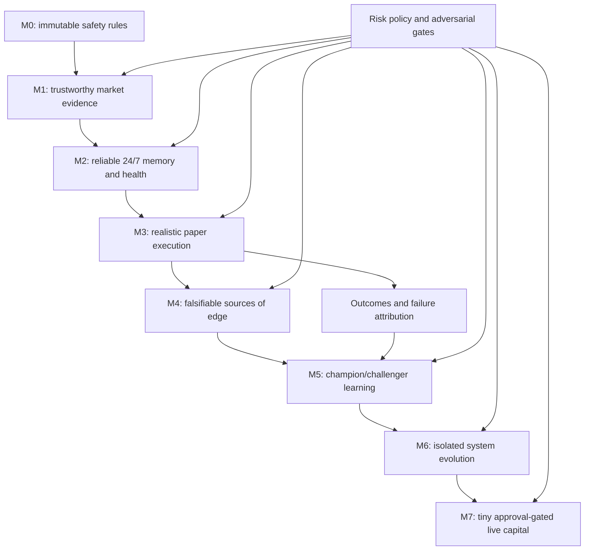

# Mental model and knowledge graph

## The one-sentence model

Reliable operation creates trustworthy evidence; trustworthy evidence allows realistic simulation; simulation can test an edge; only a validated edge plus execution and risk control can create durable profit.

Do not mentally compress those six claims into “the trading system works.” Each layer must earn its own evidence.

## Where we are

| Layer | Claim | State | What would disprove it |
|---|---|---|---|
| M0 | The system cannot silently escape paper mode or relax approved risk | Established in code and tests | A bypass, mutable limit, credential path, or live endpoint |
| M1 | At least one legal venue has sufficiently reliable, structured, executable public data | Mechanical gate met; Kalshi passes the configured quality screen, while formal review and legal/account eligibility remain | Insufficient rules, quotes, depth, availability, or legal/account eligibility |
| M2 | One Mac can preserve state and detect failure continuously | Deployed paper-only and mechanically eligible; formal promotion review remains | Duplicate writer, stale heartbeat, corrupt state, unrecoverable restart, missed schedule |
| M3 | Paper fills and position lifecycles resemble possible real outcomes | M3.7 is mechanically eligible with zero reconciliation errors; formal promotion review remains | Midpoint fills, optimistic queue, stranded positions, guessed settlements, ignored fees/latency/depth, or one venue hiding another |
| M4 | A signal has incremental predictive value after costs | M4.1-B found exact-market peer candidates; Betwick and Kekkone are observation leads, but no three-expert cohort or signal exists | Look-ahead, selection bias, linked wallets, follower chains, delay decay, regime dependence, or negative out-of-sample value |
| M5-M6 | The system can improve without grading or rewriting its own safety test | Not built | Self-promotion, test weakening, leakage, or failed rollback |
| M7 | Small live capital can be operated legally and safely | Locked | Any missing prior gate or missing fresh approval |

The correct current statement is: **we have improved the quality of future learning, not proved profitability.**

At `2026-08-15T22:43:34Z`, configuration v3 used Betwick's 166 material target actions across 31 exact markets to generate 65 mechanical peers and 20 review rows. API requests and local action filters share the same 90-day window. Materiality uses net directional exposure, so offsetting gross volume cannot fake a view. No price or time-to-resolution gate was applied. Kekkone is the strongest new observation lead: six shared target markets, ten matching actions, public X linkage and no sub-minute matches with Betwick, but its public samples are truncated and beneficial-owner independence is unproved. PhilIvey9 matched 15 times across seven markets, always 22 seconds after Betwick at the median and always within one minute; it is therefore a follower-control candidate, not independent expert evidence. Twenty-three market samples hit the public 10,000-row cap, so presence is evidence while absence is not. The user's three-independent-expert hypothesis still cannot emit a signal.

M3 segment 1 proved that execution evidence could be recorded, but its broad-market lookup stranded a finalized Kalshi position. Its 46 valid intents and 30 failures are retained as diagnostic history and excluded from promotion. Segment 2 and its repair evidence are also retained; segment 3 is the current promotion boundary and has met its mechanical time, venue-count and reconciliation gates pending formal review.

M3 now runs that counterfactual on public point-orderbook evidence. It automatically creates the smallest execution probe, but it still does not contain a predictive signal: buy/close probe PnL measures spread, latency, depth and fee friction only. Its mechanical time, sample and reconciliation gates have been met; formal adversarial promotion review remains required.

The post-M3.6 snapshot at `2026-08-02T22:44:12Z` is: M1 has 193 venue samples over 48.43 hours; M2 has 118 eligible runtime cycles over 29.48 hours; active M3 segment 2 has two valid intents, zero failed probes and zero reconciliation errors over 0.26 hours. Two natural LaunchAgent cycles recovered the two stale lifecycles, all 14 new evidence seals re-verified, SQLite integrity was `ok`, and M4 remained locked. These are reliability and execution-correctness facts, not a return claim.

M3.7 increases evidence density without changing the M2 clock: the single M2 LaunchAgent still wakes every 15 minutes, but the one writer now attempts one fresh-book probe for each configured venue. Aggregate volume cannot hide a broken venue because every venue must independently contribute at least 250 valid intents. Segment 3 is the promotion boundary for this configuration; prior segments remain queryable history.

The first natural M3.7 cycle was 460 at `2026-08-05T18:01:01Z`: it completed in 6.953 seconds, recorded one independent Polymarket US intent and one Kalshi intent, and reconciled both exactly. Segment 3 therefore began at `2026-08-05T18:01:08.247402Z` with two valid intents, zero failures and zero reconciliation errors. This establishes that dual-venue scheduling and accounting work in the live paper runtime; it still says nothing about predictive alpha or profitability.

By cycle 464, segment 3 had nine valid intents and one visible Kalshi rejection for a non-two-sided book. Polymarket US still recorded its independent intent in that cycle, M2 remained healthy and reconciliation errors remained zero. In the knowledge graph, this is a useful execution-quality observation: rejecting non-executable evidence is correctness, not lost alpha.

## What changed from the previous work

| Previous state | v1.2.0 state | Why it matters |
|---|---|---|
| Old and new Git histories competed | One clean source repository | Code provenance is understandable |
| Runtime evidence lived mainly in append logs | SQLite is the runtime source of truth; raw evidence remains immutable | Queries, constraints, reconciliation, and recovery become deterministic |
| Liveness was inferred from a scheduled job | Heartbeat, freshness, exit status, and health checks are explicit | “No error seen” is no longer mistaken for “healthy” |
| Another process could become a second writer | A non-blocking writer lock rejects overlap | Retries cannot silently duplicate state |
| Old evidence could be lost or casually copied | Migration creates a full archive, per-file SHA-256 manifest, import ledger, and count reconciliation | Evidence continuity is auditable |
| Old M1 samples could falsely inflate M2 uptime | Imported venue evidence is tagged and excluded from the M2 stability clock | One milestone cannot borrow another milestone's proof |
| Failure mostly appeared in logs | Structured alerts and fail-closed health exist | Failure becomes machine-detectable |
| A live database file might be copied inconsistently | SQLite online backup plus integrity check | Recovery evidence is meaningful |
| Service installation could be mistaken for service operation | The write-once M2 clock starts inside the first launchd `service-cycle`; two planned cycles and exit codes were observed | Runtime claims now begin with actual execution |

## The three evidence clocks

Keep these separate in your mind:

1. **Venue clock (M1):** imported M1 samples and future M2 collection both test whether the market-data venue is usable.
2. **Runtime clock (M2):** starts once, at the actual M2 service cutover. Imported history and manual probes do not count toward its 168-hour/600-cycle gate.
3. **Execution clock (M3):** starts with the first finalized runtime paper intent in the active evidence segment. A correctness repair archives the old segment and starts a fresh clock without deleting its orders, failures or lessons.

This separation prevents a classic self-deception: using data quality to claim infrastructure reliability, or using infrastructure uptime to claim realistic execution.

## The knowledge graph vocabulary

- **Risk policy:** immutable user-approved boundary; strategies cannot edit it.
- **Snapshot/raw evidence:** what the system could know at that time; never a trading conclusion by itself.
- **SQLite state:** authoritative operational memory, not Git content.
- **Heartbeat:** proof of recent execution, not proof of correct trading.
- **Health:** deterministic operational checks, not profitability.
- **Alert:** a durable failure fact requiring attention; not merely a log line.
- **Paper account:** capital accounting laboratory; not a real wallet.
- **Strategy hypothesis:** a falsifiable proposed reason for earning returns.
- **Champion/challenger:** controlled comparison, not free self-modification.
- **Promotion gate:** a rule fixed before seeing the result.
- **Live approval:** a separate human decision that no prior technical milestone can imply.

## How to reason about every future update

Ask four questions in order:

1. **Which layer changed?** Reliability, data, execution realism, edge, learning, or capital?
2. **What new claim is now justified?** State it narrowly.
3. **What evidence supports it, and what still disproves it?** Include sample size, time, failures, and out-of-sample behavior.
4. **Which gate remains locked?** Never let progress in one layer silently unlock another.

The compounding loop is therefore:

`reliable evidence -> falsifiable experiment -> realistic outcome -> attributed lesson -> gated change -> new evidence`

Time compounds only if each loop preserves truth. Automating a biased or unrealistic loop compounds error instead.
