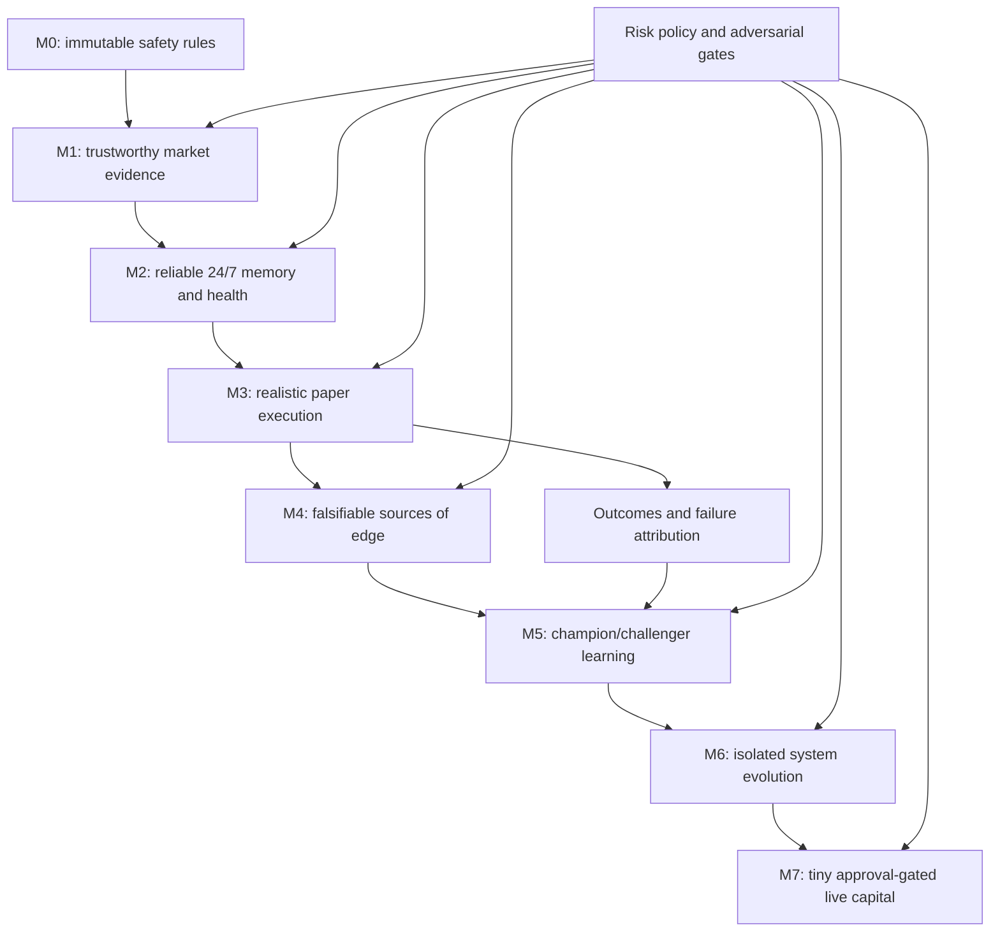

# Mental model and knowledge graph

## The one-sentence model

Reliable operation creates trustworthy evidence; trustworthy evidence allows realistic simulation; simulation can test an edge; only a validated edge plus execution and risk control can create durable profit.

Do not mentally compress those six claims into “the trading system works.” Each layer must earn its own evidence.

## Where we are

| Layer | Claim | State | What would disprove it |
|---|---|---|---|
| M0 | The system cannot silently escape paper mode or relax approved risk | Established in code and tests | A bypass, mutable limit, credential path, or live endpoint |
| M1 | At least one legal venue has sufficiently reliable, structured, executable public data | Collecting evidence | Insufficient uptime, samples, rules, quotes, depth, or account eligibility |
| M2 | One Mac can preserve state and detect failure continuously | Implemented; seven-day runtime evidence must still accrue | Duplicate writer, stale heartbeat, corrupt state, unrecoverable restart, missed schedule |
| M3 | Paper fills resemble possible real fills | Not built | Midpoint fills, ignored fees/latency/depth/settlement |
| M4 | A signal has incremental predictive value after costs | Not established | Look-ahead, selection bias, regime dependence, or negative out-of-sample value |
| M5-M6 | The system can improve without grading or rewriting its own safety test | Not built | Self-promotion, test weakening, leakage, or failed rollback |
| M7 | Small live capital can be operated legally and safely | Locked | Any missing prior gate or missing fresh approval |

The correct current statement is: **we have improved the quality of future learning, not proved profitability.**

## What changed from the previous work

| Previous state | v1.2.0 state | Why it matters |
|---|---|---|
| Old and new Git histories competed | One clean source repository | Code provenance is understandable |
| Runtime evidence lived mainly in append logs | SQLite is the runtime source of truth; raw evidence remains immutable | Queries, constraints, reconciliation, and recovery become deterministic |
| Liveness was inferred from a scheduled job | Heartbeat, freshness, exit status, and health checks are explicit | “No error seen” is no longer mistaken for “healthy” |
| Another process could become a second writer | A non-blocking writer lock rejects overlap | Retries cannot silently duplicate state |
| Old evidence could be lost or casually copied | Migration creates a full archive, per-file SHA-256 manifest, import ledger, and count reconciliation | Evidence continuity is auditable |
| Old M1 samples could falsely inflate M2 uptime | Imported venue evidence is tagged and excluded from the M2 stability clock | One milestone cannot borrow another milestone's proof |
| Failure mostly appeared in logs | Structured alerts and fail-closed health exist | Failure becomes machine-detectable |
| A live database file might be copied inconsistently | SQLite online backup plus integrity check | Recovery evidence is meaningful |

## The two evidence clocks

Keep these separate in your mind:

1. **Venue clock (M1):** imported M1 samples and future M2 collection both test whether the market-data venue is usable.
2. **Runtime clock (M2):** starts once, at the actual M2 service cutover. Imported history and manual probes do not count toward its 168-hour/600-cycle gate.

This separation prevents a classic self-deception: using old data quality evidence to claim new infrastructure reliability.

## The knowledge graph vocabulary

- **Risk policy:** immutable user-approved boundary; strategies cannot edit it.
- **Snapshot/raw evidence:** what the system could know at that time; never a trading conclusion by itself.
- **SQLite state:** authoritative operational memory, not Git content.
- **Heartbeat:** proof of recent execution, not proof of correct trading.
- **Health:** deterministic operational checks, not profitability.
- **Alert:** a durable failure fact requiring attention; not merely a log line.
- **Paper account:** capital accounting laboratory; not a real wallet.
- **Strategy hypothesis:** a falsifiable proposed reason for earning returns.
- **Champion/challenger:** controlled comparison, not free self-modification.
- **Promotion gate:** a rule fixed before seeing the result.
- **Live approval:** a separate human decision that no prior technical milestone can imply.

## How to reason about every future update

Ask four questions in order:

1. **Which layer changed?** Reliability, data, execution realism, edge, learning, or capital?
2. **What new claim is now justified?** State it narrowly.
3. **What evidence supports it, and what still disproves it?** Include sample size, time, failures, and out-of-sample behavior.
4. **Which gate remains locked?** Never let progress in one layer silently unlock another.

The compounding loop is therefore:

`reliable evidence -> falsifiable experiment -> realistic outcome -> attributed lesson -> gated change -> new evidence`

Time compounds only if each loop preserves truth. Automating a biased or unrealistic loop compounds error instead.
